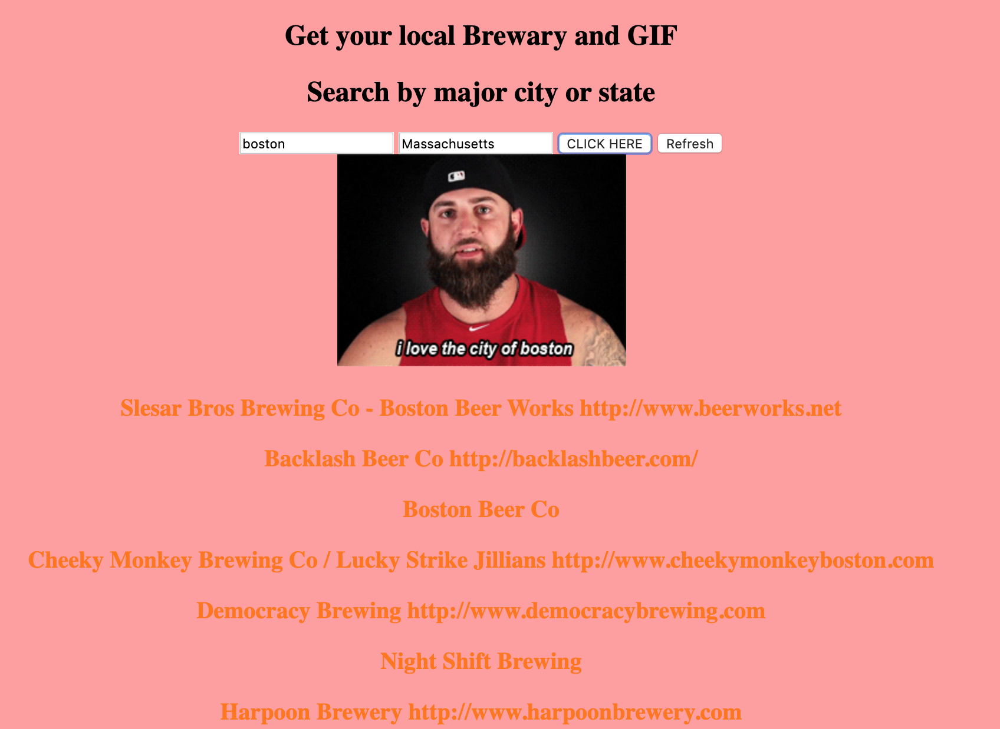

# 📊 Project: Complex API

### Goal: Use data returned from one api to make a request to another api and display the data returned

### In this project a created an application where a user can get a recommendations on local breweries depending on the location they choose.  They will also at the same time get a GIPHY that is associated with the City:

### Click here to find your next brewery: https://blissful-shirley-fa3170.netlify.com/

Tech Used:
- HTLM5
- CSS
- Javascript
- Brewery api
- GIPHY API
