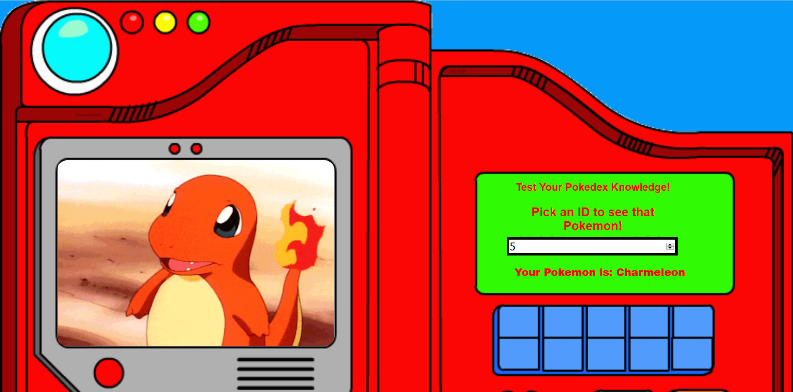

# 📊 Project: Complex API 
link: https://infallible-wiles-846eda.netlify.com/

### Goal: Use data returned from one api to make a request to another api and display the data returned

### How I did it:

- Made an input tag with type number to better allow scrolling, and to persuade the user to use numbers
- Added an event listener to the input, activates on change
- Used the input to get a Pokemon object from the Pokemon API
- Took the name and used it to append to a hidden P tag
- Used that same name as the search parameter in an API call to a giphy database
- Pulled a giffy object from their database and used the image url to append to the page
