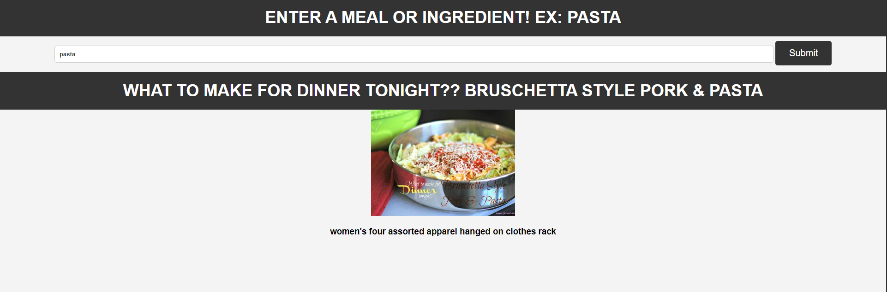

# 📊 Project: Complex API 

### Goal: Use data returned from one api to make a request to another api and display the data returned

This Project was my first attempt to use Data from one API to communicate with another API, This was super interesting to see how far the API rabbit hole can truly go, making fetches to other API's with certain Data properties i choose as in this example a image from a ingredient name!

### How it's Made
Tech used: HTML, CSS, Javascript

I tried to create it as a simple recipe search.

### Lessons Learned
I learned alot API's functionality & how to properly make a fetch to another API with Data, I also leard how to target & manipulate the data to send exactly what i wanted to target to the second API.

## Example

