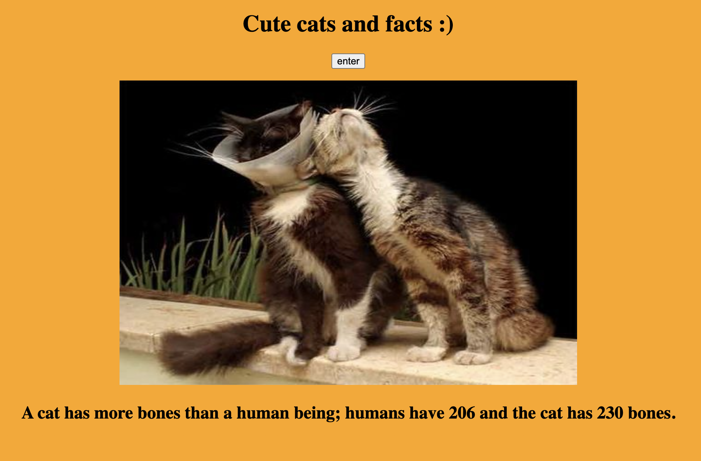

# 📊 Project: Complex API

### Goal: Use data returned from one api to make a request to another api and display the data returned

### I created an app using two api's where you get an image of a cat and a random cat fact

[Checkout My Portfolio](https://www.tamikasterlin.com)

