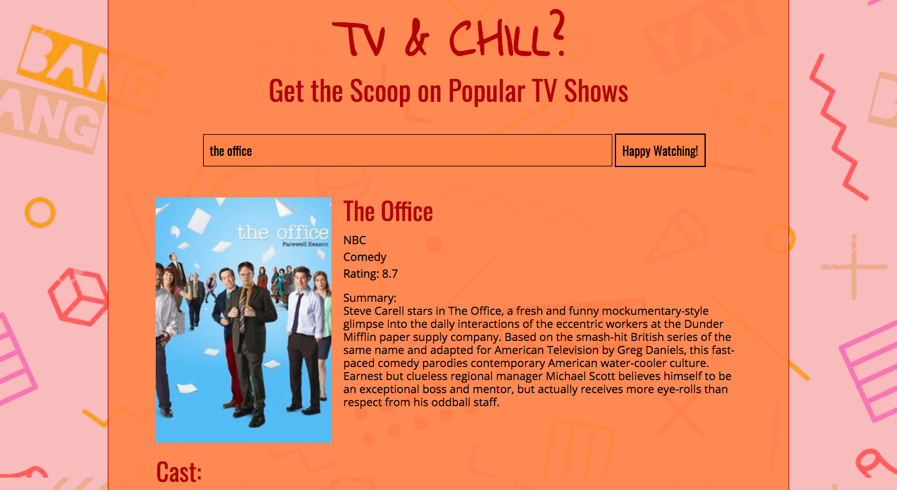

# 📊 Project: Complex API - TV Show Info

### Goal: Users can enter a tv show to fetch and display info from TV Maze's API. From that fetch, use the show's ID to fetch and display cast. Lastly fetch GIFs of all characters on the show using GIPHY's API.

**View project in browser:** https://endev-tvshow-complex-api

## Design and Development:
**Tech Used** HTML, CSS, JavaScript, API, JSON: 
Using two of TVMaze's API endpoints, users can enter the name of a TV show and the first fetch will display information about that show. From the endpoint, we get the show's ID which can be used to fetch the cast and character names to display. From the character names, use GIPHY's API to fetch gifs of each character.

## Reflections:
First time using 3 fetch calls and it was great to see everything connecting together and function properly. To not exhaust fetch calls, once I was satisfied with my results- I pasted the results into my HTML to style and deleted them once completed.

## API Source:
**TVMaze:** https://www.tvmaze.com/blogs/3/tv-api

**GIPHY:** https://developers.giphy.com/
