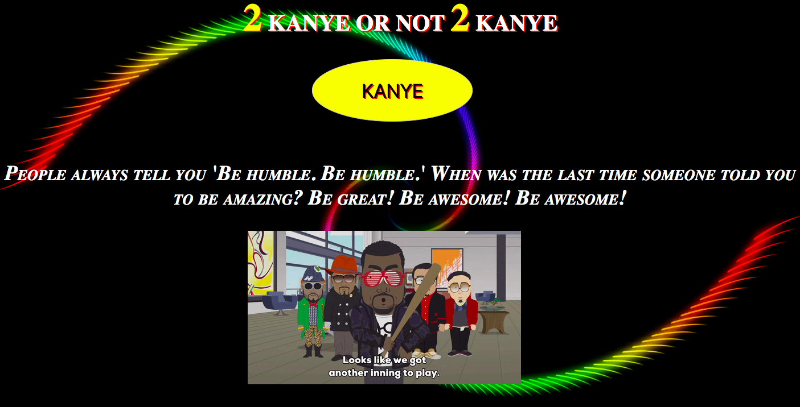

# 📊 Project: Complex API  (KANYE WEST)

### Goal: Display data returned from an api

This API gives the user a random Kanye gif with a random Kanye quote whenever the button is clicked.
I did this with two APIs for this project. 

TOOLS used: HTML, CSS, JAVASCRIPT

