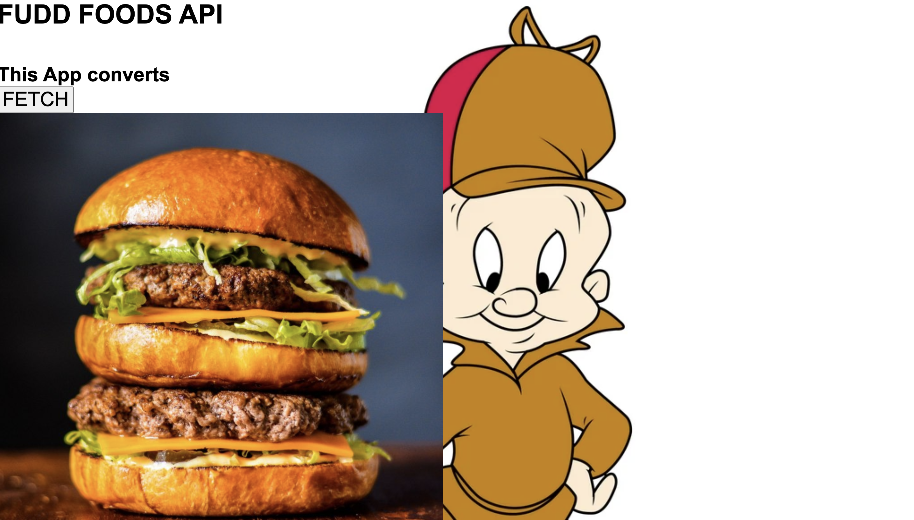

This is a Elmer Fudd food app that returns a recipe with a photo and directions in Elmer Fudd translation.

Link to Project: [https://juliedodev-complexapi1.netlify.app]

How It's Made;

Tech used: 
<ul>
<li>HTML<li>
<li>CSS</li>
<li>JavaScript<li>
</ul>

Optimizations:

Lesson Learned:

I learned how to write a fetch statement and use an API to translate the data.