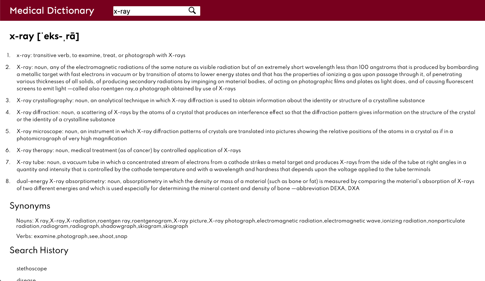

# Complex API: Medical Dictionary
#### Project Scope: Enter a medical term in the input to fetch the definition through Merriam Webster's medical dictionary API and synonyms through the Big Huge Thesaurus API. 
#### View here: https://svdev-dictionary.netlify.com

# How it was made:
#### HTML5, CSS3, Javascript E6, API, JSON

# Optimizations:
#### Search history is recorded in the bottom of the page to keep track of terms. 

# Lesson Learned: 
#### Keep in mind utility when developing applications. This entails creating features and incorporating API's that share relevancy with the product. 

# Source: 
#### Merriam Webster: https://dictionaryapi.com/
#### Big Huge Thesaurus: https://words.bighugelabs.com/site/api
