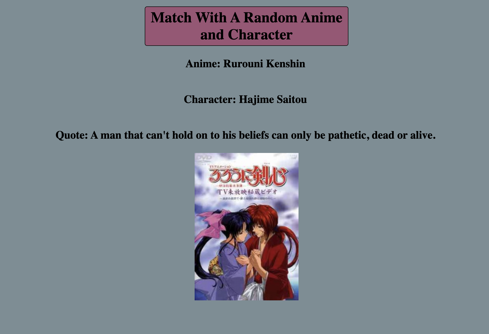

# 📊 Project: Complex API 

## Link to project 

<a href="https://complexappi1.netlify.app" rel="nofollow">Visit Website</a>

### Goal: I used the data returned from one api to make a request to another api and display the data returned

