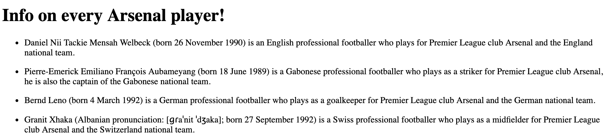

# My Awesome Project
In this project it populates the players of the Arsenal soccer team and then displays wiki faccts about the individual players.

## How It's Made:

**Tech used:** HTML, CSS, JavaScript, Framework of choice

In this project I used a sports team API and a Wiki facts API. I used the sports API to display the Arsenal soccer team's players. I then used the wiki facts to look up facts about each player.

## Lessons Learned:

I learned a little more on how APIs work and how to use two APIs at once to recieve information.
