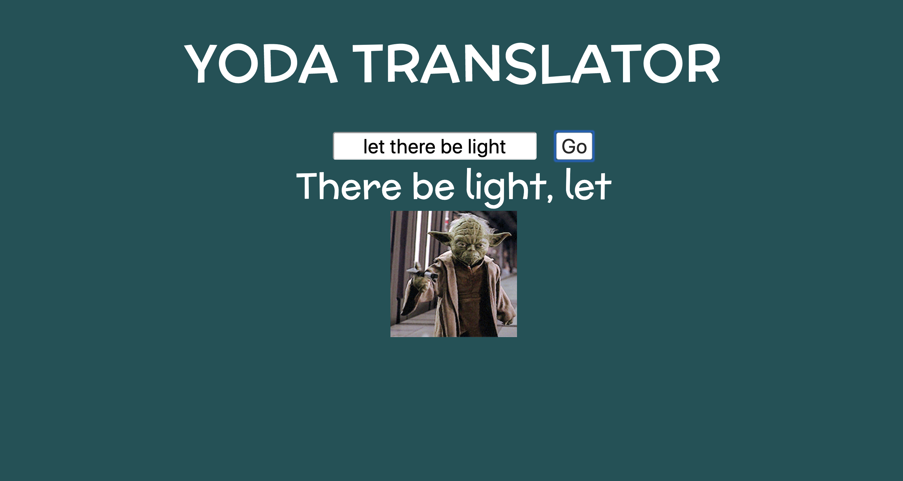

# 📊 Project: Complex API 

### Goal: Use data returned from one api to make a request to another api and display the data returned

## Try out the yoda translator here: https://lucid-jennings-5a04e5.netlify.com/

## Technologies Used:
- HTML 
- CSS 
- Javascript 
- Yoda Translation API 
- Giphy Api