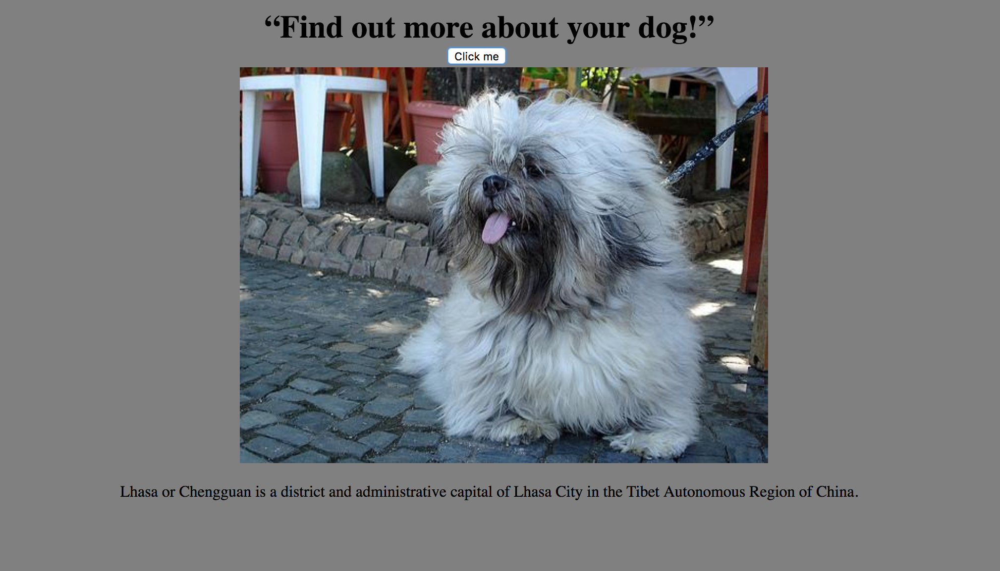

# 📊 Week07 Bootcamp2019a Project: Complex API

### Goal: Use data returned from one api to make a request to another api and display the data returned

## How It's Made:

**Tech used:** HTML, CSS, JavaScript

## Optimizations

## Lessons Learned:
