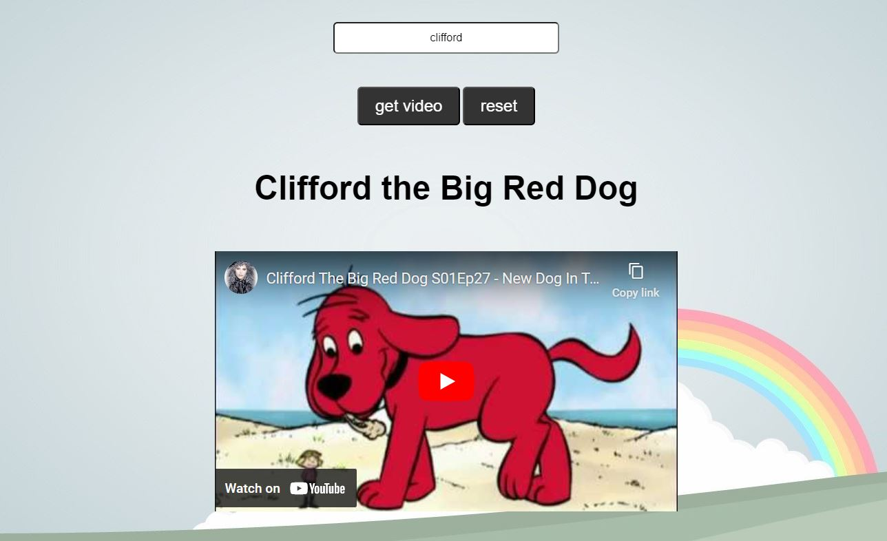

# 📊  Children's Video API

Used data returned from a media API to make a request to the YouTube API. Users can type in titles of children's media and a relevant video will appear.

Link to project: https://menahassan-childrens-movie-api.netlify.app/

# How It's Made
Tech used: HTML, CSS, JavaScript

# Lessons Learned:
Working on this project allowed me to practice using the fetch method to grab data from an API. 

Once you find a functional API, the rest of the work is fairly straightforward. You just need to map out the path to each data point you're looking to grab. This process looks slightly different for each API you're using since not all data is organized the same way but there's enough of an overlap so that you can generally get a sense of the pattern you need to follow.

This project also taught me the value of pivoting. I initially had this setup as just a generic movie API but noticed the YouTube API did not like bringing up certain movie videos in the browser -- this issue didn't seem to be happening with kids content so I decided rebranding was the move.

