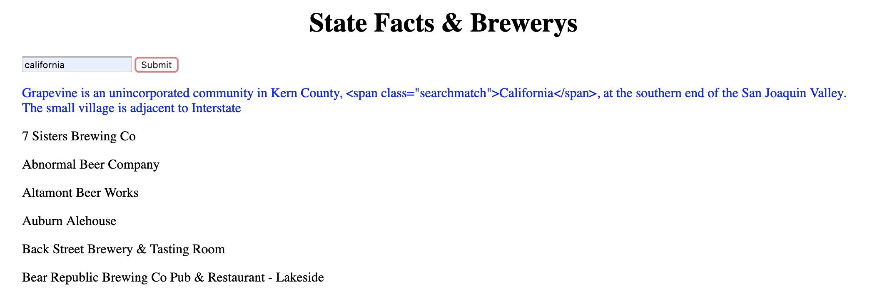

# My Awesome Project
In this project the user can enter their state and recieve a fact about their state and the local breweries within their state.

## How It's Made:

**Tech used:** HTML, CSS, JavaScript, Framework of choice

In this project I used a brewery api and a wiki api in order to get the information displayed. The user inputs their state and then the breweries in that state. I used two fetch calls in order to get the information.

## Lessons Learned:

I learned a little more on how APIs work and how to use two APIs at once to recieve information.
