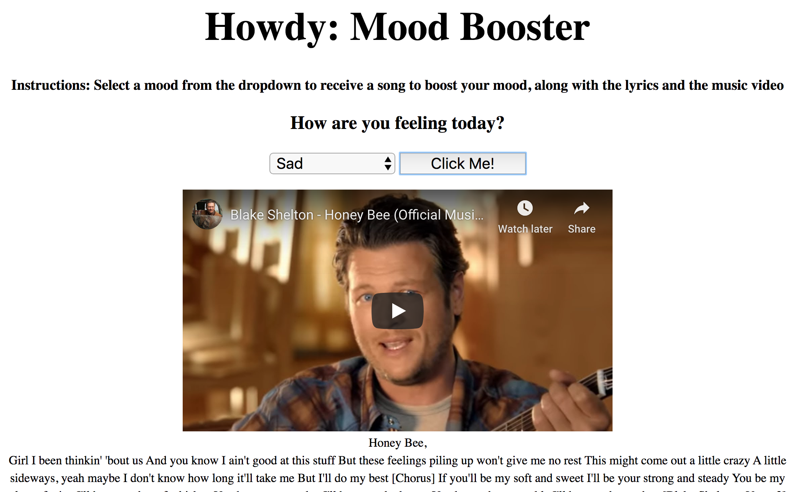

# 📊 Project: Complex API

### Goal: Use data returned from one api to make a request to another api and display the data returned

* **Project Title: Mood Booster**
  - "Mood Booster" is a webpage that allows you to decide your mood then receive a song  to hopefully help lift your spirits.

* **Overview**
  - It pulls data from two API's. It receives lyrics to a song from one, and a song title from another one.
  - This page was created for country music lovers. Country music is known for its sad songs. However there are lots of songs with happy anthems, that can indeed lift your spirits. If you are having a day in which you're sad, angry, tired, or even unsure, head on over choose your mood from the dropdown. You are guaranteed to feel better by the end of the recommended song.(videos are included)

* **link to project**: https://relaxed-noyce-d25ce6.netlify.com

* **Image of project in use**

* **Getting Started**
  - Click on the link above
  - choose your mood from the dropdown menu
  - Enjoy! use the lyrics below to the video to sing along if you choose :)
